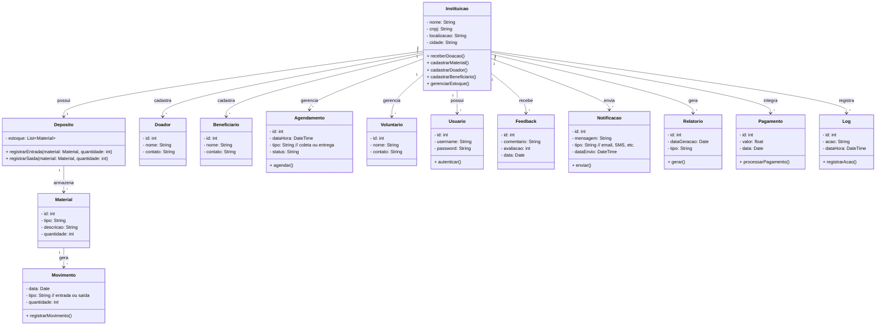

# Aula-ENGENHARIA-DE-SOFTWARE
Unemat

- [Aula-ENGENHARIA-DE-SOFTWARE](#aula-engenharia-de-software)
  - [1. Introdução](#1-introdução)
  - [2. Descrição](#2-descrição)
  - [2.1. Requisitos](#21-requisitos)
  - [2.2. Requisitos funcionais e não funcionais](#22-requisitos-funcionais-e-não-funcionais)
- [3. Diagramas](#3-diagramas)
  - [3.1 Diagrama de classe](#31-diagrama-de-classe)
  - [3.2.  Diagrama ER](#32--diagrama-er)
    - [diagrama feito no white star(versão1)](#diagrama-feito-no-white-starversão1)
    - [diagrama feito no assistente de AI](#diagrama-feito-no-assistente-de-ai)
  - [3.2. Diagrama de casos de uso](#32-diagrama-de-casos-de-uso)
  - [3.3. Diagrama de atividade](#33-diagrama-de-atividade)

## 1. Introdução 
Projeto de engenharia de software para gestão de TCC 

*Dada a realidade da cidade economica social da cidade de XYZ, onde temos 
vários moradores em situação precária e finan
Tarefa de casa 
*

## 2. Descrição 
|id| Requisitos|
|--|-----------|
|1| Temos uma instituição sem fins lucrativos |
|2| A instituição tem os seguintes atributos: nome, cnpj, localização, cidade|
|3| A inttituição recebe doação de materias de construção|
|4| A instituiçâo  tem um deposito| 
|5| A instituição recebe materias do tipo: tijolo,cimento e telhas|
|6| A instituição tem um cadastro de materiais|
|7| A instituição tem um cadastro dos doadores|
|8| A instituição tem  um cadastro dos beneficiários|
|9|	O sistema deve gerenciar o estoque, registrando a entrada e saída dos materiais no depósito.|
|10|Gerar relatórios periódicos sobre doações recebidas, distribuição dos materiais e níveis de estoque para facilitar a tomada de decisão.|
|11|Incluir um módulo para agendamento de coletas junto aos doadores e entregas aos beneficiários.|
|12|Manter um histórico detalhado de todas as movimentações de materiais, garantindo rastreabilidade e transparência.|
|13|Enviar notificações automáticas aos administradores quando os níveis de estoque atingirem valores críticos.|
|14|Possuir um módulo de cadastro e gerenciamento de voluntários que colaboram com a instituição.|
|15|Implementar mecanismos de segurança, como autenticação, autorização e backup de dados, para proteger as informações da instituição.|
|16|Permitir a integração com redes sociais para divulgação de campanhas, eventos e ações da instituição.|
|17|Incluir uma funcionalidade de avaliação e feedback dos doadores e beneficiários para melhoria contínua dos processos.|
|18|Enviar notificações automáticas por e-mail ou SMS para alertar sobre eventos, agendamentos e atualizações de estoque.|
|19|Oferecer um dashboard interativo com métricas e gráficos sobre doações, movimentações de materiais e desempenho institucional.|
|20|Suportar múltiplos idiomas, garantindo acessibilidade a usuários de diferentes regiões.|
|21|Possibilitar a exportação de dados e relatórios em formatos como CSV e PDF para fins de auditoria e análises.|
|22|Implementar mecanismos avançados de pesquisa e filtragem para facilitar a consulta de cadastros e movimentações.|
|23|Integrar-se com plataformas de pagamento para facilitar doações online de forma segura e transparente.|
|24|Registrar logs de todas as atividades, possibilitando auditoria e monitoramento da segurança e integridade dos dados.|
|25|Ser responsivo, garantindo compatibilidade e boa usabilidade em dispositivos móveis e diferentes navegadores.|

## 2.1. Requisitos
## 2.2. Requisitos funcionais e não funcionais 
>[!TIP] 
>faça uma tabela usando Markdown, com duas colunas uma indicando o requisitos e a outra coluna indicando
se o requisito é "Não funcional", para esta tarefa use a lista a baixo:

| Requisito | Tipo |
|-----------|------|
| 1. Temos uma instituição sem fins lucrativos | Funcional |
| 2. A instituição tem os seguintes atributos: nome, cnpj, localização, cidade | Funcional |
| 3. A instituição recebe doação de materiais de construção | Funcional |
| 4. A instituição tem um depósito | Funcional |
| 5. A instituição recebe materiais do tipo: tijolo, cimento e telhas | Funcional |
| 6. A instituição tem um cadastro de materiais | Funcional |
| 7. A instituição tem um cadastro dos doadores | Funcional |
| 8. A instituição tem um cadastro dos beneficiários | Funcional |
| 9. O sistema deve gerenciar o estoque, registrando a entrada e saída dos materiais no depósito | Funcional |
| 10. Gerar relatórios periódicos sobre doações recebidas, distribuição dos materiais e níveis de estoque para facilitar a tomada de decisão | Funcional |
| 11. Incluir um módulo para agendamento de coletas junto aos doadores e entregas aos beneficiários | Funcional |
| 12. Manter um histórico detalhado de todas as movimentações de materiais, garantindo rastreabilidade e transparência | Funcional |
| 13. Enviar notificações automáticas aos administradores quando os níveis de estoque atingirem valores críticos | Funcional |
| 14. Possuir um módulo de cadastro e gerenciamento de voluntários que colaboram com a instituição | Funcional |
| 15. Implementar mecanismos de segurança, como autenticação, autorização e backup de dados, para proteger as informações da instituição | Não Funcional |
| 16. Permitir a integração com redes sociais para divulgação de campanhas, eventos e ações da instituição | Funcional |
| 17. Incluir uma funcionalidade de avaliação e feedback dos doadores e beneficiários para melhoria contínua dos processos | Funcional |
| 18. Enviar notificações automáticas por e-mail ou SMS para alertar sobre eventos, agendamentos e atualizações de estoque | Funcional |
| 19. Oferecer um dashboard interativo com métricas e gráficos sobre doações, movimentações de materiais e desempenho institucional | Funcional |
| 20. Suportar múltiplos idiomas, garantindo acessibilidade a usuários de diferentes regiões | Não Funcional |
| 21. Possibilitar a exportação de dados e relatórios em formatos como CSV e PDF para fins de auditoria e análises | Funcional |
| 22. Implementar mecanismos avançados de pesquisa e filtragem para facilitar a consulta de cadastros e movimentações | Funcional |
| 23. Integrar-se com plataformas de pagamento para facilitar doações online de forma segura e transparente | Funcional |
| 24. Registrar logs de todas as atividades, possibilitando auditoria e monitoramento da segurança e integridade dos dados | Não Funcional |
| 25. Ser responsivo, garantindo compatibilidade e boa usabilidade em dispositivos móveis e diferentes navegadores | Não Funcional |

# 3. Diagramas 

## 3.1 Diagrama de classe

>[!TIP]
> Faça um diagrama de classe usanndo Markdown e Mermaid, para os requisitos abaixo

## 3.2.  Diagrama ER 
### diagrama feito no white star(versão1)

### diagrama feito no assistente de AI

## 3.2. Diagrama de casos de uso 

## 3.3. Diagrama de atividade 
