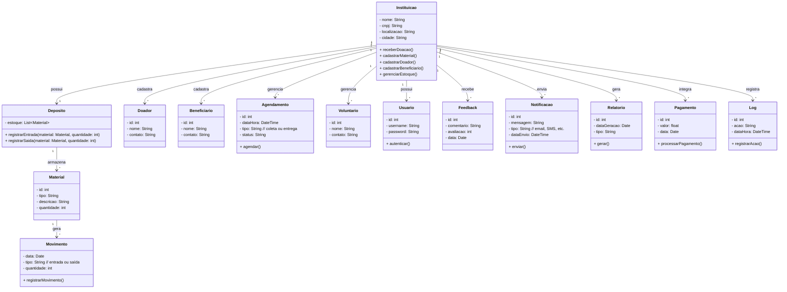

# Aula-ENGENHARIA-DE-SOFTWARE
Unemat

- [Aula-ENGENHARIA-DE-SOFTWARE](#aula-engenharia-de-software)
  - [1. Introdução](#1-introdução)
  - [2. Descrição](#2-descrição)
  - [2.1. Requisitos](#21-requisitos)
  - [2.2. Requisitos funcionais e não funcionais](#22-requisitos-funcionais-e-não-funcionais)
- [3. Diagramas](#3-diagramas)
  - [3.1 Diagrama de classe](#31-diagrama-de-classe)
    - [3.1.1.Explicação](#311explicação)
  - [3.2.  Diagrama ER](#32--diagrama-er)
    - [diagrama feito no white star(versão1)](#diagrama-feito-no-white-starversão1)
    - [diagrama feito no assistente de AI](#diagrama-feito-no-assistente-de-ai)
  - [3.2. Diagrama de casos de uso](#32-diagrama-de-casos-de-uso)
  - [3.3. Diagrama de atividade](#33-diagrama-de-atividade)
  - [3.4 Diagrama de componentes](#34-diagrama-de-componentes)
  - [3.5 Diagrama  de implatação](#35-diagrama--de-implatação)
  - [3.6 Diagrama C4](#36-diagrama-c4)
    - [3.6.1 Diagrama C4 de contexto](#361-diagrama-c4-de-contexto)
    - [3.6.2 Diagrama C4 de conteiner](#362-diagrama-c4-de-conteiner)
    - [3.6.2 Diagrama C4 de componente](#362-diagrama-c4-de-componente)
    - [3.6.3 Diagrama C4 de código](#363-diagrama-c4-de-código)
  - [4. Histórias de usuário](#4-histórias-de-usuário)
  - [5. Protótipo de telas](#5-protótipo-de-telas)
  - [6. Diagram](#6-diagram)
    - [A.1. Script SQL](#a1-script-sql)
    - [A.2. Dados ariticiais para teste de banco](#a2-dados-ariticiais-para-teste-de-banco)
- [8. Cronograma e Gantt](#8-cronograma-e-gantt)
- [9. Custos](#9-custos)


## 1. Introdução 
Projeto de engenharia de software para gestão de TCC 

*Dada a realidade da cidade economica social da cidade de XYZ, onde temos 
vários moradores em situação precária e finan
Tarefa de casa 
*

## 2. Descrição 
|id| Requisitos|
|--|-----------|
|1| Temos uma instituição sem fins lucrativos |
|2| A instituição tem os seguintes atributos: nome, cnpj, localização, cidade|
|3| A inttituição recebe doação de materias de construção|
|4| A instituiçâo  tem um deposito| 
|5| A instituição recebe materias do tipo: tijolo,cimento e telhas|
|6| A instituição tem um cadastro de materiais|
|7| A instituição tem um cadastro dos doadores|
|8| A instituição tem  um cadastro dos beneficiários|
|9|	O sistema deve gerenciar o estoque, registrando a entrada e saída dos materiais no depósito.|
|10|Gerar relatórios periódicos sobre doações recebidas, distribuição dos materiais e níveis de estoque para facilitar a tomada de decisão.|
|11|Incluir um módulo para agendamento de coletas junto aos doadores e entregas aos beneficiários.|
|12|Manter um histórico detalhado de todas as movimentações de materiais, garantindo rastreabilidade e transparência.|
|13|Enviar notificações automáticas aos administradores quando os níveis de estoque atingirem valores críticos.|
|14|Possuir um módulo de cadastro e gerenciamento de voluntários que colaboram com a instituição.|
|15|Implementar mecanismos de segurança, como autenticação, autorização e backup de dados, para proteger as informações da instituição.|
|16|Permitir a integração com redes sociais para divulgação de campanhas, eventos e ações da instituição.|
|17|Incluir uma funcionalidade de avaliação e feedback dos doadores e beneficiários para melhoria contínua dos processos.|
|18|Enviar notificações automáticas por e-mail ou SMS para alertar sobre eventos, agendamentos e atualizações de estoque.|
|19|Oferecer um dashboard interativo com métricas e gráficos sobre doações, movimentações de materiais e desempenho institucional.|
|20|Suportar múltiplos idiomas, garantindo acessibilidade a usuários de diferentes regiões.|
|21|Possibilitar a exportação de dados e relatórios em formatos como CSV e PDF para fins de auditoria e análises.|
|22|Implementar mecanismos avançados de pesquisa e filtragem para facilitar a consulta de cadastros e movimentações.|
|23|Integrar-se com plataformas de pagamento para facilitar doações online de forma segura e transparente.|
|24|Registrar logs de todas as atividades, possibilitando auditoria e monitoramento da segurança e integridade dos dados.|
|25|Ser responsivo, garantindo compatibilidade e boa usabilidade em dispositivos móveis e diferentes navegadores.|

## 2.1. Requisitos
## 2.2. Requisitos funcionais e não funcionais 
>[!TIP] 
>faça uma tabela usando Markdown, com duas colunas uma indicando o requisitos e a outra coluna indicando
se o requisito é "Não funcional", para esta tarefa use a lista a baixo:

| Requisito | Tipo |
|-----------|------|
| 1. Temos uma instituição sem fins lucrativos | Funcional |
| 2. A instituição tem os seguintes atributos: nome, cnpj, localização, cidade | Funcional |
| 3. A instituição recebe doação de materiais de construção | Funcional |
| 4. A instituição tem um depósito | Funcional |
| 5. A instituição recebe materiais do tipo: tijolo, cimento e telhas | Funcional |
| 6. A instituição tem um cadastro de materiais | Funcional |
| 7. A instituição tem um cadastro dos doadores | Funcional |
| 8. A instituição tem um cadastro dos beneficiários | Funcional |
| 9. O sistema deve gerenciar o estoque, registrando a entrada e saída dos materiais no depósito | Funcional |
| 10. Gerar relatórios periódicos sobre doações recebidas, distribuição dos materiais e níveis de estoque para facilitar a tomada de decisão | Funcional |
| 11. Incluir um módulo para agendamento de coletas junto aos doadores e entregas aos beneficiários | Funcional |
| 12. Manter um histórico detalhado de todas as movimentações de materiais, garantindo rastreabilidade e transparência | Funcional |
| 13. Enviar notificações automáticas aos administradores quando os níveis de estoque atingirem valores críticos | Funcional |
| 14. Possuir um módulo de cadastro e gerenciamento de voluntários que colaboram com a instituição | Funcional |
| 15. Implementar mecanismos de segurança, como autenticação, autorização e backup de dados, para proteger as informações da instituição | Não Funcional |
| 16. Permitir a integração com redes sociais para divulgação de campanhas, eventos e ações da instituição | Funcional |
| 17. Incluir uma funcionalidade de avaliação e feedback dos doadores e beneficiários para melhoria contínua dos processos | Funcional |
| 18. Enviar notificações automáticas por e-mail ou SMS para alertar sobre eventos, agendamentos e atualizações de estoque | Funcional |
| 19. Oferecer um dashboard interativo com métricas e gráficos sobre doações, movimentações de materiais e desempenho institucional | Funcional |
| 20. Suportar múltiplos idiomas, garantindo acessibilidade a usuários de diferentes regiões | Não Funcional |
| 21. Possibilitar a exportação de dados e relatórios em formatos como CSV e PDF para fins de auditoria e análises | Funcional |
| 22. Implementar mecanismos avançados de pesquisa e filtragem para facilitar a consulta de cadastros e movimentações | Funcional |
| 23. Integrar-se com plataformas de pagamento para facilitar doações online de forma segura e transparente | Funcional |
| 24. Registrar logs de todas as atividades, possibilitando auditoria e monitoramento da segurança e integridade dos dados | Não Funcional |
| 25. Ser responsivo, garantindo compatibilidade e boa usabilidade em dispositivos móveis e diferentes navegadores | Não Funcional |


# 3. Diagramas 

## 3.1 Diagrama de classe


>[!TIP]
> Faça um diagrama de classe usanndo Markdown e Mermaid, para os requisitos abaixo




### 3.1.1.Explicação
Instituicao: Representa a organização sem fins lucrativos, com atributos essenciais como nome, cnpj, localização e cidade. Além disso, a instituição gerencia cadastros e processos internos.

Deposito: Responsável pelo gerenciamento do estoque, registrando a entrada e saída dos materiais.

Material e Movimento: Os materiais doados (ex.: tijolo, cimento, telhas) são armazenados no depósito e suas movimentações (entrada e saída) são registradas em histórico.

Doador e Beneficiario: Cadastros para gerenciar as entidades que doam e recebem materiais.

Agendamento: Gerencia as coletas de doadores e as entregas aos beneficiários.

Voluntario: Cadastro dos voluntários que colaboram com a instituição.

Usuario: Responsável pelo acesso ao sistema, incluindo autenticação e segurança.

Feedback: Armazena avaliações e comentários dos doadores e beneficiários.

Notificacao: Controla o envio de notificações automáticas (e-mail, SMS, etc.) para alertar sobre eventos e atualizações.

Relatorio: Geração de relatórios periódicos para análise de doações e movimentações de estoque.

Pagamento: Integração com plataformas de pagamento para doações online.

Log: Registro de atividades para auditoria e monitoramento da segurança do sistema.

## 3.2.  Diagrama ER 
Faça uma diagrama de Entidade de Relocionamento usanndo Markdown e Mermaid, para os requisitos abaixo


### diagrama feito no white star(versão1)


### diagrama feito no assistente de AI


## 3.2. Diagrama de casos de uso 


## 3.3. Diagrama de atividade 
O diagrama de atividades é utilizado para modelar o fluxo de controle ou de atividades dentro de um sistema, representando processos, decisões, paralelismos e sequências de ações. Ele é especialmente útil para descrever logicamente como uma funcionalidade é executada, seja em um processo de negócio ou em um algoritmo, permitindo visualizar caminhos alternativos, ramificações e condições. Muito empregado em análise de requisitos e modelagem de processos, esse diagrama facilita a compreensão e validação do comportamento do sistema por todos os envolvidos no projeto.


```mermaid
flowchart TD
    Start([Início])  
    Start --> PreencherForm[Preencher formulário de doação]  

    PreencherForm --> ValidarDoador{Doador cadastrado?}  
    ValidarDoador -- Não --> CadastrarDoador[Cadastrar Doador]  
    CadastrarDoador --> RegistrarDoacao[Registrar doação de materiais]  
    ValidarDoador -- Sim --> RegistrarDoacao  

    RegistrarDoacao --> AgendarColeta[Agendar coleta]  
    AgendarColeta --> EfetuarColeta[Efetuar coleta de materiais]  
    EfetuarColeta --> MovimentacaoEntrada[Registrar movimentação (entrada)]  
    MovimentacaoEntrada --> AtualizarEstoque[Atualizar estoque]  

    AtualizarEstoque --> EstoqueCritico{Estoque abaixo do mínimo?}  
    EstoqueCritico -- Sim --> EnviarNotificacao[Enviar notificação crítica]  
    EstoqueCritico -- Não --> AguardarEntrega  

    AguardarEntrega[Entregar ao beneficiário]  
    AguardarEntrega --> ConfirmarEntrega{Entrega confirmada?}  
    ConfirmarEntrega -- Não --> RegistrarLogErro[Registrar log de falha na entrega]  
    RegistrarLogErro --> End([Fim])  
    ConfirmarEntrega -- Sim --> ColetarFeedback[Coletar feedback do beneficiário]  

    ColetarFeedback --> RegistrarFeedback[Registrar feedback]  
    RegistrarFeedback --> GerarRelatorio[Gerar relatório de doações]  
    EnviarNotificacao --> GerarRelatorio  

    GerarRelatorio --> RegistrarLog[Registrar log de atividade]  
    RegistrarLog --> End([Fim])  


 ```

## 3.4 Diagrama de componentes 

```mermaid
graph TB
  %% Front-End Component
  subgraph Front-End
    UI[Web UI <<component>>]
  end

  %% Back-End Components
  subgraph Back-End
    APIGW[API Gateway <<component>>]
    AuthSvc[Auth Service <<component>>]
    DonationSvc[Donation Service <<component>>]
    InventorySvc[Inventory Service <<component>>]
    SchedulingSvc[Scheduling Service <<component>>]
    NotificationSvc[Notification Service <<component>>]
    ReportingSvc[Reporting Service <<component>>]
    FeedbackSvc[Feedback Service <<component>>]
  end

  %% Integration Components
  subgraph Integrações
    SocialInt[Social Media Integration <<component>>]
    PaymentInt[Payment Integration <<component>>]
  end

  %% Persistence
  subgraph BancoDeDados
    DB[(Database)]
  end

  %% Fluxo de chamadas
  UI --> APIGW
  APIGW --> AuthSvc
  APIGW --> DonationSvc
  APIGW --> InventorySvc
  APIGW --> SchedulingSvc
  APIGW --> NotificationSvc
  APIGW --> ReportingSvc
  APIGW --> FeedbackSvc

  %% Integrações externas
  DonationSvc --> SocialInt
  DonationSvc --> PaymentInt

  %% Persistência de dados
  AuthSvc --> DB
  DonationSvc --> DB
  InventorySvc --> DB
  SchedulingSvc --> DB
  NotificationSvc --> DB
  ReportingSvc --> DB
  FeedbackSvc --> DB

 ```

## 3.5 Diagrama  de implatação 


## 3.6 Diagrama C4

### 3.6.1 Diagrama C4 de contexto 
### 3.6.2 Diagrama C4 de conteiner
### 3.6.2 Diagrama C4 de componente
### 3.6.3 Diagrama C4 de código

## 4. Histórias de usuário
## 5. Protótipo de telas 
## 6. Diagram


### A.1. Script SQL 

>[!TIP]
>faça um script para MYSQL, para o diagrama mermaid acima 


```SQL

-- Remover tabelas existentes (ordem inversa das dependências)
DROP TABLE IF EXISTS Log;
DROP TABLE IF EXISTS Pagamento;
DROP TABLE IF EXISTS Relatorio;
DROP TABLE IF EXISTS Notificacao;
DROP TABLE IF EXISTS Feedback;
DROP TABLE IF EXISTS Usuario;
DROP TABLE IF EXISTS Voluntario;
DROP TABLE IF EXISTS Agenda;
DROP TABLE IF EXISTS Beneficiario;
DROP TABLE IF EXISTS Doador;
DROP TABLE IF EXISTS Movimentacao;
DROP TABLE IF EXISTS Material;
DROP TABLE IF EXISTS Deposito;
DROP TABLE IF EXISTS Instituicao;

-- Tabela Instituicao
CREATE TABLE Instituicao (
    id INT AUTO_INCREMENT PRIMARY KEY,
    nome VARCHAR(255) NOT NULL,
    cnpj VARCHAR(20) NOT NULL,
    localizacao VARCHAR(255) NOT NULL,
    cidade VARCHAR(100) NOT NULL
);

-- Tabela Deposito (relaçâo 1:1 com Instituicao)
CREATE TABLE Deposito (
    id INT AUTO_INCREMENT PRIMARY KEY,
    instituicao_id INT NOT NULL,
    FOREIGN KEY (instituicao_id) REFERENCES Instituicao(id)
);

-- Tabela Material (relacionada ao Deposito)
CREATE TABLE Material (
    id INT AUTO_INCREMENT PRIMARY KEY,
    deposito_id INT NOT NULL,
    tipo VARCHAR(50) NOT NULL,
    quantidade INT NOT NULL,
    FOREIGN KEY (deposito_id) REFERENCES Deposito(id)
);

-- Tabela Movimentacao (relacionada ao Material)
CREATE TABLE Movimentacao (
    id INT AUTO_INCREMENT PRIMARY KEY,
    material_id INT NOT NULL,
    data DATE NOT NULL,
    tipo ENUM('entrada', 'saida') NOT NULL,
    quantidade INT NOT NULL,
    FOREIGN KEY (material_id) REFERENCES Material(id)
);

-- Tabela Doador (relacionada à Instituicao)
CREATE TABLE Doador (
    id INT AUTO_INCREMENT PRIMARY KEY,
    instituicao_id INT NOT NULL,
    nome VARCHAR(255) NOT NULL,
    contato VARCHAR(255),
    FOREIGN KEY (instituicao_id) REFERENCES Instituicao(id)
);

-- Tabela Beneficiario (relacionada à Instituicao)
CREATE TABLE Beneficiario (
    id INT AUTO_INCREMENT PRIMARY KEY,
    instituicao_id INT NOT NULL,
    nome VARCHAR(255) NOT NULL,
    contato VARCHAR(255),
    FOREIGN KEY (instituicao_id) REFERENCES Instituicao(id)
);

-- Tabela Agenda (para agendamentos de coletas e entregas)
CREATE TABLE Agenda (
    id INT AUTO_INCREMENT PRIMARY KEY,
    instituicao_id INT NOT NULL,
    dataHora DATETIME NOT NULL,
    tipo ENUM('coleta', 'entrega') NOT NULL,
    status VARCHAR(50),
    FOREIGN KEY (instituicao_id) REFERENCES Instituicao(id)
);

-- Tabela Voluntario (relacionada à Instituicao)
CREATE TABLE Voluntario (
    id INT AUTO_INCREMENT PRIMARY KEY,
    instituicao_id INT NOT NULL,
    nome VARCHAR(255) NOT NULL,
    contato VARCHAR(255),
    FOREIGN KEY (instituicao_id) REFERENCES Instituicao(id)
);

-- Tabela Usuario (para controle de acesso)
CREATE TABLE Usuario (
    id INT AUTO_INCREMENT PRIMARY KEY,
    instituicao_id INT NOT NULL,
    username VARCHAR(100) NOT NULL,
    password VARCHAR(255) NOT NULL,
    FOREIGN KEY (instituicao_id) REFERENCES Instituicao(id)
);

-- Tabela Feedback (avaliações e comentários)
CREATE TABLE Feedback (
    id INT AUTO_INCREMENT PRIMARY KEY,
    instituicao_id INT NOT NULL,
    comentario TEXT,
    avaliacao INT,
    data DATE,
    FOREIGN KEY (instituicao_id) REFERENCES Instituicao(id)
);

-- Tabela Notificacao (envio de alertas)
CREATE TABLE Notificacao (
    id INT AUTO_INCREMENT PRIMARY KEY,
    instituicao_id INT NOT NULL,
    mensagem TEXT,
    tipo VARCHAR(50),
    dataEnvio DATETIME NOT NULL,
    FOREIGN KEY (instituicao_id) REFERENCES Instituicao(id)
);

-- Tabela Relatorio (geração de relatórios)
CREATE TABLE Relatorio (
    id INT AUTO_INCREMENT PRIMARY KEY,
    instituicao_id INT NOT NULL,
    dataGeracao DATE NOT NULL,
    tipo VARCHAR(50),
    FOREIGN KEY (instituicao_id) REFERENCES Instituicao(id)
);

-- Tabela Pagamento (integração com plataformas de pagamento)
CREATE TABLE Pagamento (
    id INT AUTO_INCREMENT PRIMARY KEY,
    instituicao_id INT NOT NULL,
    valor DECIMAL(10,2) NOT NULL,
    data DATE NOT NULL,
    FOREIGN KEY (instituicao_id) REFERENCES Instituicao(id)
);

-- Tabela Log (registro de atividades para auditoria)
CREATE TABLE Log (
    id INT AUTO_INCREMENT PRIMARY KEY,
    instituicao_id INT NOT NULL,
    acao TEXT,
    dataHora DATETIME NOT NULL,
    FOREIGN KEY (instituicao_id) REFERENCES Instituicao(id)
);


```

### A.2. Dados ariticiais para teste de banco 

>[!TIP]
>Faça um Sript SQL para MySQL, usando os comandos Create table anteriores, para
popular as tabelas do banco com pelo menos 5 registros ficticios 

```SQL
-- Inserindo dados na tabela Instituicao
INSERT INTO Instituicao (nome, cnpj, localizacao, cidade) VALUES
('Instituição A', '12345678000199', 'Rua A, 100', 'São Paulo'),
('Instituição B', '98765432000188', 'Av. B, 200', 'Rio de Janeiro'),
('Instituição C', '11223344000177', 'Alameda C, 300', 'Belo Horizonte'),
('Instituição D', '55667788000166', 'Rua D, 400', 'Curitiba'),
('Instituição E', '99887766000155', 'Av. E, 500', 'Porto Alegre');

-- Inserindo dados na tabela Deposito (1 depósito para cada Instituicao)
INSERT INTO Deposito (instituicao_id) VALUES
(1),
(2),
(3),
(4),
(5);

-- Inserindo dados na tabela Material (associados aos depósitos)
INSERT INTO Material (deposito_id, tipo, quantidade) VALUES
(1, 'Tijolo', 1000),
(2, 'Cimento', 500),
(3, 'Telha', 750),
(4, 'Tijolo', 1200),
(5, 'Cimento', 600);

-- Inserindo dados na tabela Movimentacao (associados aos materiais)
INSERT INTO Movimentacao (material_id, data, tipo, quantidade) VALUES
(1, '2025-03-01', 'entrada', 200),
(2, '2025-03-02', 'entrada', 150),
(3, '2025-03-03', 'saida', 100),
(4, '2025-03-04', 'entrada', 300),
(5, '2025-03-05', 'saida', 50);

-- Inserindo dados na tabela Doador (cada um associado a uma Instituicao)
INSERT INTO Doador (instituicao_id, nome, contato) VALUES
(1, 'Doador A', 'doadorA@example.com'),
(2, 'Doador B', 'doadorB@example.com'),
(3, 'Doador C', 'doadorC@example.com'),
(4, 'Doador D', 'doadorD@example.com'),
(5, 'Doador E', 'doadorE@example.com');

-- Inserindo dados na tabela Beneficiario (cada um associado a uma Instituicao)
INSERT INTO Beneficiario (instituicao_id, nome, contato) VALUES
(1, 'Beneficiário A', 'benefA@example.com'),
(2, 'Beneficiário B', 'benefB@example.com'),
(3, 'Beneficiário C', 'benefC@example.com'),
(4, 'Beneficiário D', 'benefD@example.com'),
(5, 'Beneficiário E', 'benefE@example.com');

-- Inserindo dados na tabela Agenda (para agendamentos de coletas/entregas)
INSERT INTO Agenda (instituicao_id, dataHora, tipo, status) VALUES
(1, '2025-03-10 09:00:00', 'coleta', 'agendado'),
(2, '2025-03-11 10:00:00', 'entrega', 'confirmado'),
(3, '2025-03-12 11:00:00', 'coleta', 'pendente'),
(4, '2025-03-13 12:00:00', 'entrega', 'cancelado'),
(5, '2025-03-14 13:00:00', 'coleta', 'agendado');

-- Inserindo dados na tabela Voluntario
INSERT INTO Voluntario (instituicao_id, nome, contato) VALUES
(1, 'Voluntário A', 'volA@example.com'),
(2, 'Voluntário B', 'volB@example.com'),
(3, 'Voluntário C', 'volC@example.com'),
(4, 'Voluntário D', 'volD@example.com'),
(5, 'Voluntário E', 'volE@example.com');

-- Inserindo dados na tabela Usuario (para controle de acesso)
INSERT INTO Usuario (instituicao_id, username, password) VALUES
(1, 'userA', 'passA'),
(2, 'userB', 'passB'),
(3, 'userC', 'passC'),
(4, 'userD', 'passD'),
(5, 'userE', 'passE');

-- Inserindo dados na tabela Feedback (avaliações e comentários)
INSERT INTO Feedback (instituicao_id, comentario, avaliacao, data) VALUES
(1, 'Ótima experiência', 5, '2025-03-15'),
(2, 'Bom atendimento', 4, '2025-03-16'),
(3, 'Satisfeito com a doação', 5, '2025-03-17'),
(4, 'Pode melhorar', 3, '2025-03-18'),
(5, 'Excelente serviço', 5, '2025-03-19');

-- Inserindo dados na tabela Notificacao (envio de alertas)
INSERT INTO Notificacao (instituicao_id, mensagem, tipo, dataEnvio) VALUES
(1, 'Estoque baixo de tijolos', 'alerta', '2025-03-20 08:00:00'),
(2, 'Nova doação registrada', 'info', '2025-03-20 09:00:00'),
(3, 'Movimentação realizada', 'info', '2025-03-20 10:00:00'),
(4, 'Alerta de segurança', 'alerta', '2025-03-20 11:00:00'),
(5, 'Relatório mensal disponível', 'info', '2025-03-20 12:00:00');

-- Inserindo dados na tabela Relatorio (geração de relatórios)
INSERT INTO Relatorio (instituicao_id, dataGeracao, tipo) VALUES
(1, '2025-03-21', 'mensal'),
(2, '2025-03-21', 'semanal'),
(3, '2025-03-21', 'mensal'),
(4, '2025-03-21', 'diário'),
(5, '2025-03-21', 'anual');

-- Inserindo dados na tabela Pagamento (integração com plataformas de pagamento)
INSERT INTO Pagamento (instituicao_id, valor, data) VALUES
(1, 1500.00, '2025-03-22'),
(2, 2500.50, '2025-03-22'),
(3, 1800.75, '2025-03-22'),
(4, 2200.00, '2025-03-22'),
(5, 3000.00, '2025-03-22');

-- Inserindo dados na tabela Log (registro de atividades para auditoria)
INSERT INTO Log (instituicao_id, acao, dataHora) VALUES
(1, 'Usuário logado', '2025-03-23 14:00:00'),
(2, 'Material atualizado', '2025-03-23 15:00:00'),
(3, 'Doação registrada', '2025-03-23 16:00:00'),
(4, 'Agendamento criado', '2025-03-23 17:00:00'),
(5, 'Backup realizado', '2025-03-23 18:00:00');


```
# 8. Cronograma e Gantt
# 9. Custos 


